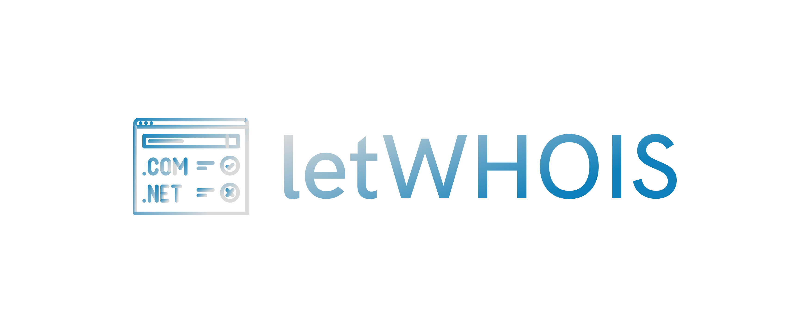

# logo.letwhois.com

## Font

        Font in use <a target="_blank" href="https://www.fontsquirrel.com/license/rex">Rex Bold</a> designed by
        <a target="_blank" href="http://www.fontfabric.com/">Fontfabric</a>
        and licensed under
        <a target="_blank" href="http://www.fontfabric.com/">Freeware.</a>
          Icon Designed by
          <a target="_blank" href="https://thenounproject.com/xoxo">XOXO</a>
          

Font

    #FF0022, #84014E
    
    
Background

    transparent

Icon

    #84014E, #FF0022    

## 1

## 2

---

+ [edit](https://github.com/letwhois/logo/edit/main/README.md)
+ [letwhois/logo/](https://github.com/letwhois/logo/)
